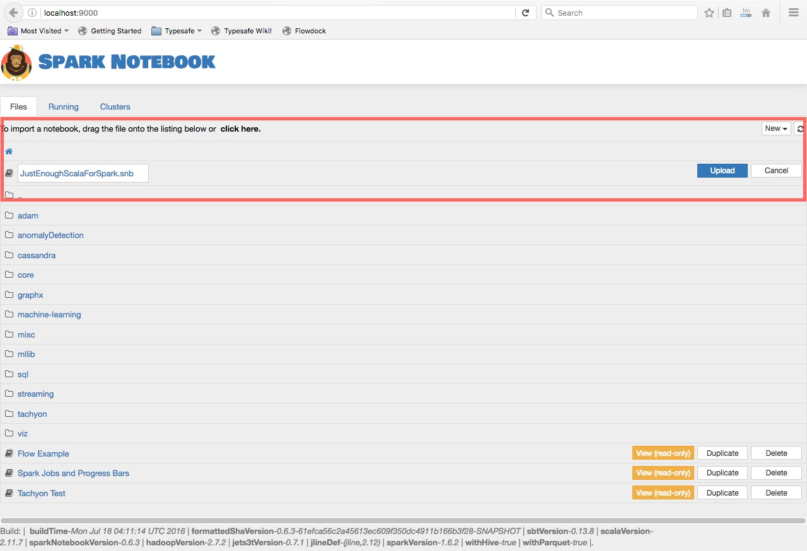

# Just Enough Scala for Spark

[](https://gitter.im/deanwampler/JustEnoughScalaForSpark?utm_source=badge&utm_medium=badge&utm_campaign=pr-badge&utm_content=badge)

Strata NYC, September 27, 2016<br/>
[Dean Wampler, Ph.D.](mailto:deanwampler@gmail.com)<br/>
[Lightbend, Inc.](http://lightbend.com)

This tutorial covers the most important features and idioms of [Scala](http://scala-lang.org/) you need to use [Apache Spark's](http://spark.apache.org/) Scala APIs. Because Spark is written in Scala, Spark is driving interest in Scala, especially for _data engineers_. _Data scientists_ sometimes use Scala, but most use Python or R.

## Prerequisites

I'll assume you have prior programming experience, in any language. Some familiarity with Java is assumed, but if you don't know Java, you should be able to search for explanations for anything unfamiliar.

This isn't an introduction to Spark itself. Some prior exposure to Spark is helpful, but I'll briefly explain most Spark concepts we'll encounter, too. 

Throughout, you'll find links to more information on important topics.

## Download the Tutorial

Begin by cloning or downloading the tutorial GitHub project [github.com/deanwampler/JustEnoughScalaForSpark](https://github.com/deanwampler/JustEnoughScalaForSpark).

## Using Spark Notebook

This tutorial uses a _notebook_ format, which is popular with data scientists, but also useful for data engineers. While most of the popular notebooks, like [iPython/Jupyter](https://ipython.org/), [Zeppelin](http://zeppelin-project.org/), and [Databricks](https://databricks.com/) support Scala, we'll use a Scala-centric notebook environment called [Spark Notebook](http://spark-notebook.io) ([http://spark-notebook.io](http://spark-notebook.io)). 

You will need to install and run the Spark Notebook runtime. You can do this either by downloading it and running it "natively" on your computer, or by running it in [Docker](https://docker.com). (Using Docker may work better on Windows.)

### Java 7 or 8

You'll need the Java 7 or 8 (preferred) JRE (Java Runtime Environment) installed. Go [here](https://java.com/en/download/help/index_installing.xml) for instructions, if necessary.

A separate Scala installation is _not_ required.

### Downloading Spark Notebook

If you want to run it "natively" (i.e., not use Docker), visit one of the following download pages and click the _Download here_ link:

* [Zip](http://spark-notebook.io/dl/zip/0.6.3/2.11/1.6.2/2.7.2/true/true) file (for all platforms).
* [Tgz](http://spark-notebook.io/dl/tgz/0.6.3/2.11/1.6.2/2.7.2/true/true) file (best for Mac OSX or Linux).

> We're using notebook version 0.6.3 built for Spark 1.6.2, Hadoop 2.7.2, and Scala 2.11, with Hive and Parquet extensions. (See [spark-notebook.io](http://spark-notebook.io) for other configurations.) We aren't using Spark 2.0.0, because support for it is still experimental, but the actual Spark version is less important for our purposes, since we're here to learn Scala.

Expand the archive somewhere convenient.

Start Spark Notebook as follows. Open a command window and change the working directory to the root directory where you expanded the Spark Notebook archive. Run the following command:
```
bin/spark-notebook
```

You'll see some log messages that then it will wait...

> If you get an error that it fails to start, make sure Java is installed and on your path. (Run `java -version` in the same command window.) If that's not an issue, try moving the Spark Notebook folder to a directory where the full path has *no* whitespace (i.e., `C:\Foo Bar\Baz` has whitespace between `Foo` and `Bar`).

Now jump to <a href="#RunningTutorial">Running the Tutorial</a>.

### Docker

If you wish to use Docker instead, first go to this [docker.com](https://www.docker.com/products/overview) page and follow the instructions to install Docker on your machine.

Once Docker is installed and running, open a command window and run these two commands to download and run the same Spark Notebook build as a Docker image.


```
docker pull andypetrella/spark-notebook:0.6.3-scala-2.11.7-spark-1.6.2-hadoop-2.7.2-with-hive-with-parquet
docker run -p 9000:9000 andypetrella/spark-notebook:0.6.3-scala-2.11.7-spark-1.6.2-hadoop-2.7.2-with-hive-with-parquet
```

<a name="RunningTutorial"></a>
## Running the Tutorial

However you started Spark Notebook, open your browser to [localhost:9000](http://localhost:9000/). The UI has a "SPARK NOTEBOOK" banner and shows several directories and notebooks for sample applications that come with Spark Notebook.

> **NOTE:** If you are using Docker and you didn't use the `-p 9000:9000` option, replace `localhost` with your Docker image IP address. On Windows or Mac OSX, use the command `docker-machine ls` or `docker-machine env` to see what it is.

Now we need to load the tutorial in Spark Notebook.

Under the banner and under the tabs ("Files", "Running", ...), the first line of text says "To import a notebook, drag the file onto the listing below or *click here.*"

The *click here* is a link. Click it, then navigate to where you downloaded the tutorial GitHub repository. Find and select `notebooks/JustEnoughScalaForSpark.snb`.

A new line in the UI is added with "JustEnoughScalaForSpark.snb" and an "Upload" button on the right-hand side, as shown in Figure 1:


<center><b>Figure 1:</b> Before Uploading the Notebook</center>

I've highlighted the "click here" link and the new line for the notebook.

Click the "Upload" button.

Now the line is moved towards the bottom of the page and the buttons on the right-hand side are different. 


<center><b>Figure 2:</b> After Uploading the Notebook</center>

Click the [JustEnoughScalaForSpark link](http://localhost:9000/notebooks/JustEnoughScalaForSpark.snb) (on the left) and the tutorial notebook will open in another browser tab. (It might take a minute to load completely.) The top of the page should look like this:


<center><b>Figure 3:</b> After Starting the Notebook</center>


> **NOTE:** If the new tab fails to open or the notebook fails to load as shown, check the terminal window where you started Spark Notebook. Are there any error messages? 
> 
> An alternative is to copy the `JustEnoughScalaForSpark.snb` notebook into the `notebooks` directory of the Spark Notebook distribution. If you aren't using docker, use any file copy method you like, if you are using docker, use the command `docker ps` to find the id of the running image (a 12-digit hex number), then use the command `docker cp /path/to/JustEnoughScalaForSpark.snb NNNN:/opt/docker/notebooks`, where you should replace `NNNN` with your actual id.
> 
> If you can't debug the issue, post questions to the [Gitter channel](https://gitter.im/deanwampler/JustEnoughScalaForSpark) or post issues to the [GitHub repo](https://github.com/deanwampler/JustEnoughScalaForSpark/issues).
 
## What's Next?

Congratulations! You are now ready to go through the tutorial. 

Please post any feedback, bugs, or even pull requests to the [project's GitHub page](https://github.com/deanwampler/JustEnoughScalaForSpark). Thanks.

Dean Wampler, September 2016
